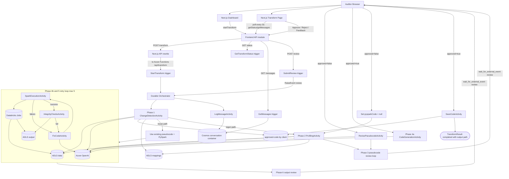

# .NET Backend + Frontend Runtime Flow

This diagram reflects the current runtime behavior of the Next.js frontend and the `src-dotnet` Azure Functions backend.

## Notes

- Frontend API calls are centralized in `frontend/lib/api.ts`.
- Frontend routes are in `frontend/app/page.tsx` and `frontend/app/transform/[id]/page.tsx`.
- Backend trigger endpoints are in `src-dotnet/src/DataEngineeringAgent.Functions/Triggers/TransformTrigger.cs`.
- Orchestration flow is in `src-dotnet/src/DataEngineeringAgent.Functions/Orchestrators/TransformOrchestrator.cs`.
